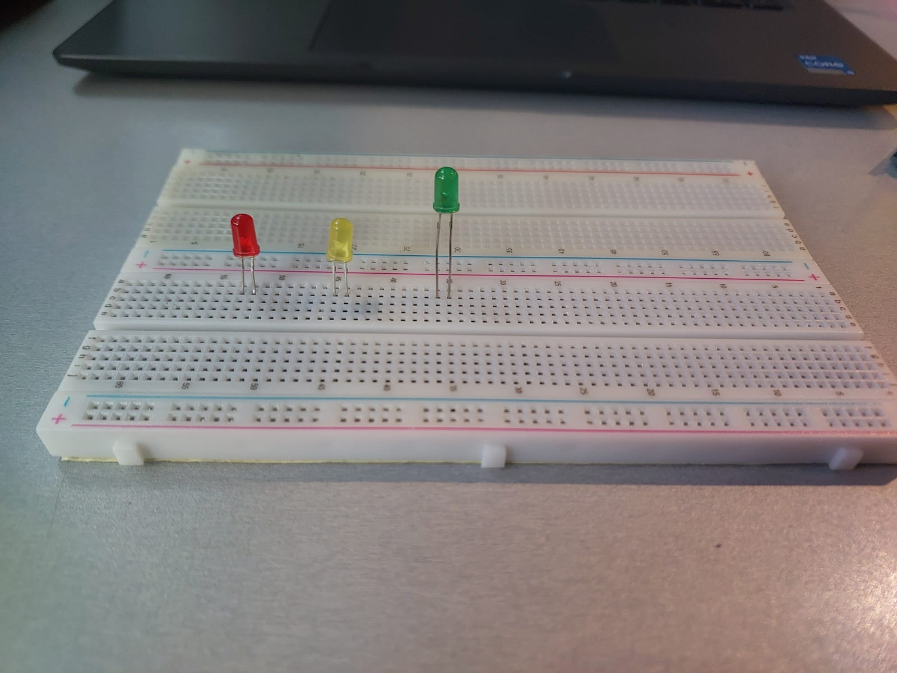
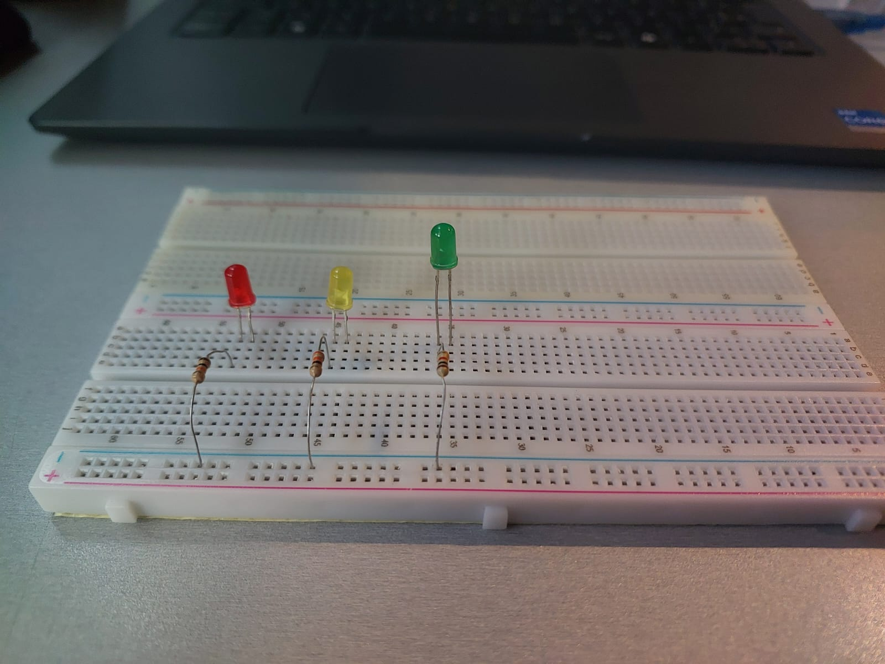
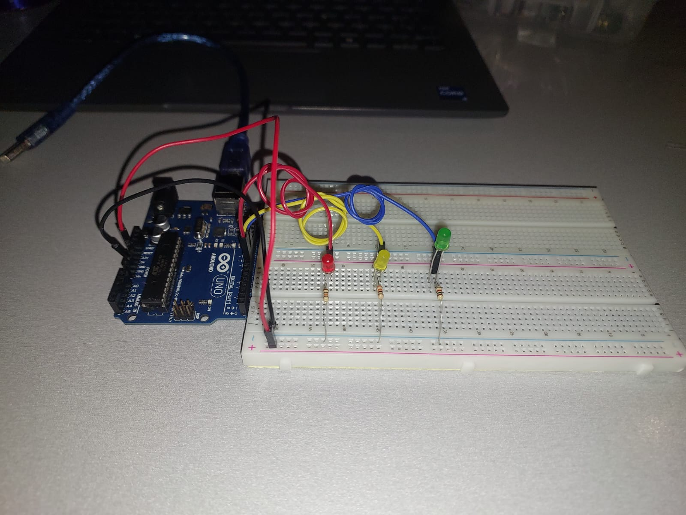
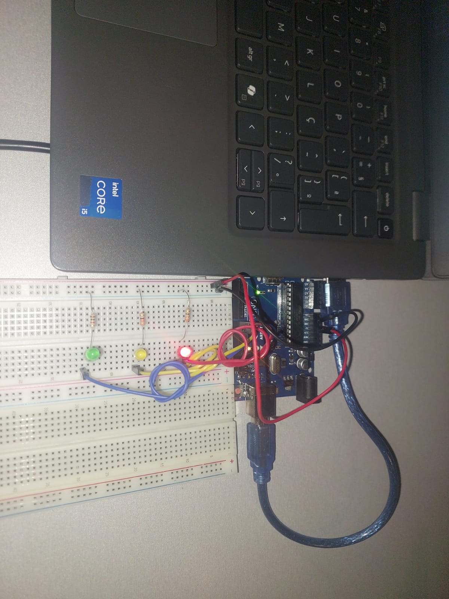
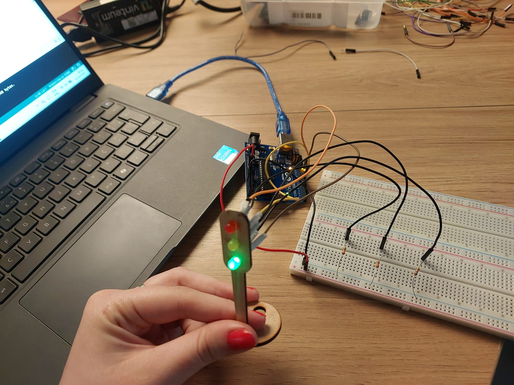

# 🚦🚦🚦 Projeto: Semáforo Inteligente para o Bairro Butantã

## Sumário
- [Autora](#autora)
- [Contexto do Projeto](#contexto-do-projeto)
- [Objetivos](#objetivos)
- [Parte 1: Montagem Física](#parte-1-montagem-física)
  - [Componentes Utilizados](#componentes-utilizados)
  - [Esquema de Ligação](#esquema-de-ligação)
  - [Tutorial de montagem](#tutorial-de-montagem)
- [Parte 2: Programação e Lógica](#parte-2-programação-e-lógica)
  - [Código](#código)
  - [Funcionamento e Testes](#funcionamento-e-testes)
  - [Vídeo de Demonstração](#vídeo-de-demonstração)
- [Parte 3: Avaliação de Pares](#parte-3-avaliação-de-pares)
- [Aprendizados e Conclusões](#aprendizados-e-conclusões)
- [Possíveis Extensões Futuras](#possíveis-extensões-futuras)
- [Licença](#licença)

---

## Autora
Mirela Schneider Bianchi

---

## Contexto do Projeto
A cidade de São Paulo possui um tráfego intenso, e o bairro do Butantã é um dos pontos de maior movimentação. O controle eficiente de semáforos é essencial para evitar congestionamentos e garantir a segurança dos pedestres.  

Este projeto visa criar uma **simulação funcional de um semáforo urbano**, seguindo tempos típicos de operação e demonstrando como princípios simples de eletrônica e programação podem contribuir para soluções reais de mobilidade urbana.

---

## Objetivos
Desenvolver a **montagem física** de um semáforo em protoboard.  
Implementar o **código de controle** com temporização para as três fases (vermelho, verde e amarelo).  
Demonstrar o **funcionamento contínuo e automatizado** do sistema.  
Aplicar conceitos de **engenharia, lógica sequencial e segurança viária**.  

---

## Parte 1: Montagem Física

### Componentes Utilizados

| Componente | Quantidade | Especificação / Função |
|-------------|-------------|------------------------|
| Arduino Uno | 1 | Controlador principal |
| LED Vermelho | 1 | Indica "Pare" |
| LED Amarelo | 1 | Indica "Atenção" |
| LED Verde | 1 | Indica "Siga" |
| Resistores | 3 | 220 Ω (proteção dos LEDs) |
| Protoboard | 1 | Montagem do circuito |
| Jumpers | 5 | Conexões entre pinos e LEDs |
| Cabo USB | 1 | Alimentação e upload do código |

---

### Esquema de Ligação

| LED | Pino Digital Arduino | Resistor | Conexão ao GND |
|------|----------------------|-----------|----------------|
| Vermelho | 8 | 330 Ω | Sim |
| Amarelo | 9 | 330 Ω | Sim |
| Verde | 10 | 330 Ω | Sim |

### Tutorial de Montagem 

1. **Posicionamento dos LEDs na Protoboard**  
   Os LEDs foram posicionados verticalmente na protoboard seguindo a ordem tradicional empregada em sistemas semafóricos: vermelho na parte superior, amarelo ao centro e verde na parte inferior.  

   Cada LED possui duas pernas (terminais):  
   - **Ânodo (terminal positivo)** → normalmente a perna **mais longa**;  
   - **Cátodo (terminal negativo)** → perna **mais curta**, geralmente próxima ao chanfro ou parte plana da cápsula.  

   No circuito, o **ânodo** é conectado ao pino digital do Arduino responsável pelo controle, enquanto o **cátodo** é conectado ao GND por meio de um resistor. Essa ligação garante o sentido correto da corrente, evitando inversão de polaridade.

<p align="center">
  
</p>

---

2. **Conexão dos Resistores (Proteção de Corrente)**  
   Cada LED foi conectado em **série** com um resistor de **220 Ω**.  

   A função do resistor é **limitar a corrente elétrica** que atravessa o LED, evitando que ele receba valores superiores ao recomendado (aproximadamente 20 mA). Sem essa proteção, o LED poderia sofrer **sobrecorrente**, ocasionando superaquecimento e queima do componente.

   Esta relação é explicada pela **Lei de Ohm**:

   V = R.I

   Onde:
   - *V* é a tensão aplicada,
   - *R* é a resistência,
   - *I* é a corrente resultante.

   Logo, ao definir R = 220 Ω, garantimos que a corrente permaneça em um nível seguro para o funcionamento contínuo dos LEDs.

<p align="center">
  
</p>

---

3. **Ligação ao Arduino e Organização dos Jumpers**

| LED | Pino Digital do Arduino (Ânodo) | Cátodo → Resistor → GND |
|-----|--------------------------------|--------------------------|
| Vermelho | **8** | Sim |
| Amarelo  | **9** | Sim |
| Verde    | **10** | Sim |

   Quando o Arduino envia um sinal **HIGH (5V)** para o pino, o LED acende; quando envia **LOW (0V)**, o LED apaga. Isso permite a criação da sequência lógica do semáforo via programação.

   Os jumpers foram organizados de maneira paralela e limpa, evitando cruzamento excessivo de fios, o que facilita:
   - Visualização do circuito
   - Identificação de falhas
   - Modificações futuras

<p align="center">
  
</p>

---

4. **Testes e Ajustes Finais**  
   Após a montagem, cada LED foi testado individualmente através de comandos simples no código (`digitalWrite(pin, HIGH/LOW)`), verificando:
   - Correta polaridade dos LEDs (ânodo e cátodo)
   - Contatos firmes na protoboard
   - Continuidade entre resistor e terra

   Pequenos ajustes foram realizados até que o ciclo completo do semáforo funcionasse de maneira estável e repetitiva.

<p align="center">
  
</p>


5. **Semáforo Final**

<p align="center">
  
</p>


## Parte 2: Programação e Lógica

O comportamento do semáforo segue a seguinte sequência temporal:

Cor /	Duração	/ Significado
- 🔴 Vermelho	6 segundos	Pare
- 🟢 Verde	4 segundos	Siga
- 🟡 Amarelo	2 segundos	Atenção / Troca de fase

### Código 
```
//classe semaforo
class Semaforo {
private:
  const int* _pinos[3]; 
  
  const long* _tempoVermelho;
  const long* _tempoAmarelo;
  const long* _tempoVerde;

  void setLuz(int indiceLuz, bool estado) {
    digitalWrite(*_pinos[indiceLuz], estado ? HIGH : LOW);
  }

public:
  Semaforo(const int* pV, const int* pA, const int* pG, 
           const long* tV, const long* tA, const long* tG)
    : _pinos{pV, pA, pG}, 
      _tempoVermelho(tV), 
      _tempoAmarelo(tA), 
      _tempoVerde(tG)
  {
    // Configura os pinos como saída
    for (int i = 0; i < 3; i++) {
      pinMode(*_pinos[i], OUTPUT);
    }
  }

  void run() {
    // Vermelho
    setLuz(0, HIGH);
    setLuz(1, LOW);
    setLuz(2, LOW);
    delay(*_tempoVermelho);

    // Verde
    setLuz(0, LOW);
    setLuz(1, LOW);
    setLuz(2, HIGH);
    delay(*_tempoVerde);

    // Amarelo
    setLuz(0, LOW);
    setLuz(1, HIGH);
    setLuz(2, LOW);
    delay(*_tempoAmarelo);
  }
};

const int PINO_VERMELHO = 8;
const int PINO_AMARELO = 9;
const int PINO_VERDE = 10;

const long TEMPO_VERMELHO = 6000;
const long TEMPO_AMARELO = 2000;
const long TEMPO_VERDE = 4000;

// Objeto usando ponteiros
Semaforo meuSemaforo(
  &PINO_VERMELHO, 
  &PINO_AMARELO, 
  &PINO_VERDE,
  &TEMPO_VERMELHO, 
  &TEMPO_AMARELO, 
  &TEMPO_VERDE
);

void setup() {
  Serial.begin(115200); 
  Serial.println("Semáforo iniciado!");
}

void loop() {
  meuSemaforo.run();
}


```
## Funcionamento e Testes

Durante os testes:
- O LED vermelho acende por 6 segundos.
- Em seguida, o LED verde permanece aceso por 4 segundos.
- Por fim, o LED amarelo acende por 2 segundos antes de reiniciar o ciclo.
Este ciclo se repete continuamente, simulando o funcionamento de um semáforo urbano em condições normais de tráfego.

 ## Vídeo de Demonstração:
[Clique aqui para assistir](https://drive.google.com/file/d/1XBrTzAYDokj0NS6a-J7hoX8oh5zeVNuE/view?usp=sharing)


## Parte 3: Avaliação de Pares

| Avaliador(a) | Comentário / Nota |
|--------------|------------------|
| Letícia Saravia       | "Ficou muito compelto e você claramente se esforçou para deixar tudo muito detalhado e toda a montagem ficou bem clara." / 10 |
| Karol Barbosa       | "A documentação está muito clara e objetiva, o circuito funciona perfeitamente, e ela aparece no vídeo demonstrando que é a autora do projeto - foi muito além." / 10 |

Critérios de avaliação:
- Clareza da montagem física
- Correção do código e tempos de execução
- Qualidade da documentação
- Demonstração em vídeo
- Aprendizados e Conclusões

## Aprendizados e Conclusões

Durante a montagem e programação do semáforo, foi possível compreender de forma prática como componentes eletrônicos básicos, como LEDs, resistores e jumpers, interagem com um microcontrolador para formar um sistema funcional. Aprendi a configurar corretamente pinos digitais do Arduino, a calcular e aplicar resistores para proteger os LEDs, e a organizar a protoboard de forma eficiente para facilitar conexões e manutenção. Além disso, a experiência permitiu consolidar conceitos de temporização em código, loops contínuos e controle sequencial, reforçando a relação direta entre hardware e software em sistemas embarcados simples.


## Possíveis Extensões Futuras
- Adicionar botão de pedestre com temporização adicional.
- Implementar sensor de movimento (ultrassônico ou infravermelho).
- Integrar com display LCD exibindo contagem regressiva.
- Criar uma rede de semáforos inteligentes sincronizados via IoT.


 ## Licença
Este projeto está licenciado sob a licença MIT — sinta-se à vontade para usar, estudar e modificar para fins educacionais.
